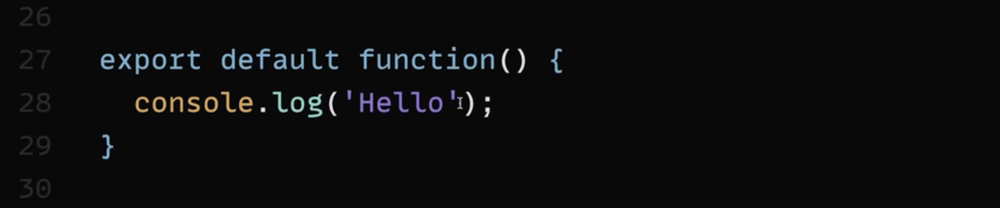
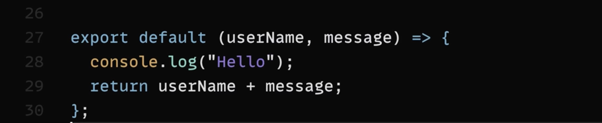
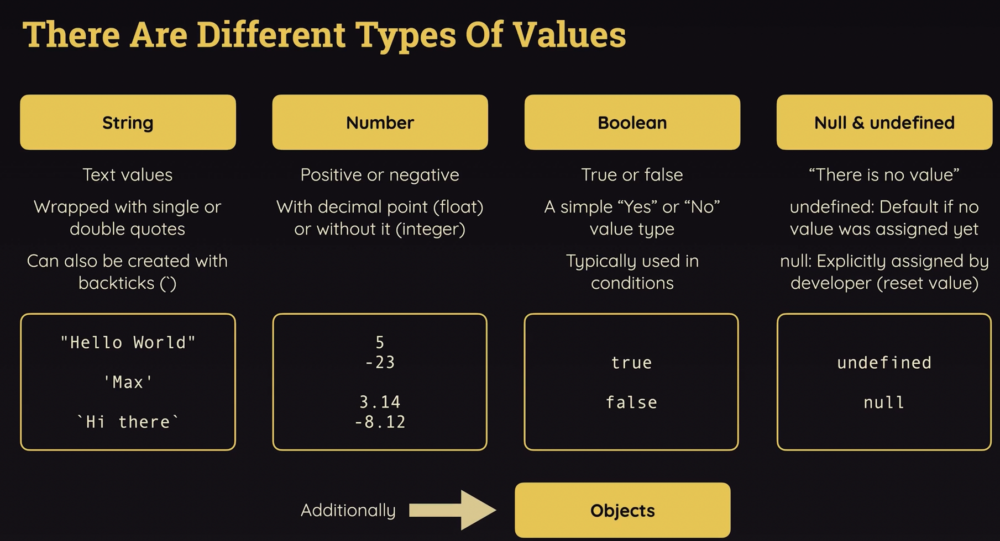
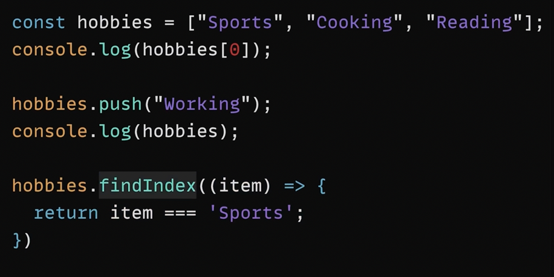

# 1. 'import' and 'export' 
    1. It's good to keep your code (component) in seperate files, that increase readability, and easy to mantain

## ways of importing content from one file to another

### Type 1

    if (export let apiKey = 'diewwoslaidenliklh'); 
**then**

    import {key} from 'filename'
<hr>

### Type 2

    if (export default apiKey = 'diewwoslaidenliklh'); 
    // with default keyword, only one item can be exported 
**then**

    import apiKey from 'filename'
<hr>

### Type 3

    export default "I'm default";
    export let apiKey = "diewwoslaidenliklh";
    export let abc = "abc";

**then**

    import apiKey from 'filename'
    import { apiKey, abc } from 'filename'

**or**

    import * as utils from 'filename'
    console.log(utils.default)
    console.log(utils.apiKey)
<hr>
 
# 2. Variable, Values and Operator

    1. Variables are simply data containers, where you defined data identifiers.
    2. For reusability and readability

### Difference between 'let' and 'const'

    1. If you define something with 'const' keyword then you can't able to redefine that variable, that variable is read-only.
    
    2. If you use 'let' keyword, you can change the value anywhere in the code if you need it.

### Operators

    1. '+' : It can be used with numbers as well as string(to concat the string)

    2. '===' : equality check operator (return 'true' or 'false')

    3. Rest are common data-types, '+','-','*','/','%','>=','<=','>','<'

    4. I've one doubt 🤔 (What is the difference between '==' and '===')
<hr>

# 3. Function 

    function greet(param1, param2,..., paramN) {
        // body
    }

    // function call
    greet(param1, param2,...,paramN) 

**OR**

    function greetUser (userName, message = "Hello!") {
        // console.log (userName) ;
        // console.log (message);
        return 'I'm ' + userName + '. ' + message;
    }

    // function call
    greetUser("Max") ; // I'm Max. Hello!
    greetUser("Manuel","Hello, what's up?"): // I'm Manuel. Hello, what's up?

## Anonymous / Arrow Function

<span style="font-size:1.3em;">This is an example of default function that's being used for to export</span>



<span style="font-size:1.3em;">This is an example of arrow function</span>



<span style="font-size:1.2em;">

1) Omitting parameter list parentheses

If your arrow functions takes exactly one parameter, you may omit the wrapping parentheses.

Instead of

    (userName) => { ... }

you could write

    userName => { ... }

**Please note:**

* If your function takes no parameters, parentheses must not be omitted - `() => { ... }` is the only correct form in that case.

* If your function takes more than one parameter, you also must not omit parentheses - userName, userAge => { ... } would be invalid ((userName, userAge) => { ... } is correct)!

2) Omitting function body curly braces

If your arrow function contains no other logic but a `return` statement, you may omit the curly braces and the `return` keyword.

Instead of

    number => { 
    return number * 3;
    }

you could write
    number => number * 3;

The following code would be invalid:

    number => return number * 3; // invalid because return keyword must also be omitted!

    number => if (number === 2) { return 5 }; // invalid because if statements can't be returned

3) Special case: Just returning an object

If you go for the shorter alternative explained in 2) and you're trying to return a **JavaScript object**, you may end up with the following, **invalid** code:

    number => { age: number }; // trying to return an object

This code would be invalid because JavaScript treats the curly braces as function body wrappers (not as code that creates a JS object).

To *"tell"* JavaScript that an object should be created (and returned) instead, the code would need to be adjusted like this:

    number => ({ age: number }); // wrapping the object in extra parentheses

By wrapping the object and its curly braces with an extra pair of parentheses, JavaScript understands that the curly braces are not there to define a function body but instead to create an object. Hence that object then gets returned.

</span>

# 4. Objects and Classes

1. Now, Let's talk about objects



Used to group multiple values that're related to each other.  
For example:-
    
    const user = {
        name: "Max",
        age: 34,
        greet() {
            console.log("Hello!");
            console.log(this.age);
        }
    }

    console.log(user.name) ;
    user.greet();
    
2. We can also create classes that are blueprints for defining the objects.
    ```
    class User {
        constructor(name, age) {
            this.name = name;
            this.age = age;
        }

        greet() {
            console.log('Hi');
        }
    }
    ```

# Arrays:

Below image will give you idea, about arrays...
You can also explore all the related functions.

