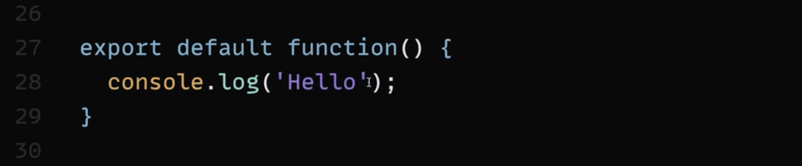
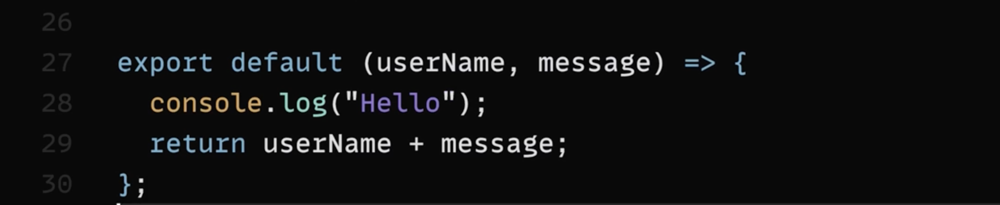

# 1. 'import' and 'export' {#custom-id}
    1. It's good to keep your code (component) in seperate files, that increase readability, and easy to mantain

## ways of importing content from one file to another

### Type 1

    if (export let apiKey = 'diewwoslaidenliklh'); 
<strong>then</strong>

    import {key} from 'filename'

### Type 2

    if (export default apiKey = 'diewwoslaidenliklh'); 
    // with default keyword, only one item can be exported 
<strong>then</strong>

    import apiKey from 'filename'

### Type 3

    export default "I'm default";
    export let apiKey = "diewwoslaidenliklh";
    export let abc = "abc";

<strong>then</strong>

    import apiKey from 'filename'
    import { apiKey, abc } from 'filename'

<strong>or</strong>

    import * as utils from 'filename'
    console.log(utils.default)
    console.log(utils.apiKey)

 
# 2. Variable, Values and Operator

    1. Variables are simply data containers, where you defined data identifiers.
    2. For reusability and readability

### Difference between 'let' and 'const'

    1. If you define something with 'const' keyword then you can't able to redefine that variable, that variable is read-only.
    
    2. If you use 'let' keyword, you can change the value anywhere in the code if you need it.

### Operators

    1. '+' : It can be used with numbers as well as string(to concat the string)

    2. '===' : equality check operator (return 'true' or 'false')

    3. Rest are common data-types, '+','-','*','/','%','>=','<=','>','<'

    4. I've one doubt 🤔 (What is the difference between '==' and '===')

# 3. Function 

    function greet(param1, param2,..., paramN) {
        // body
    }

    // function call
    greet(param1, param2,...,paramN) 

<strong>OR</strong>

    function greetUser (userName, message = "Hello!") {
        // console.log (userName) ;
        // console.log (message);
        return 'I'm ' + userName + '. ' + message;
    }

    // function call
    greetUser("Max") ; // I'm Max. Hello!
    greetUser("Manuel","Hello, what's up?"): // I'm Manuel. Hello, what's up?

## Anonymous / Arrow Function

This is an example of default function that's being used for to export

This is an example of arrow function

